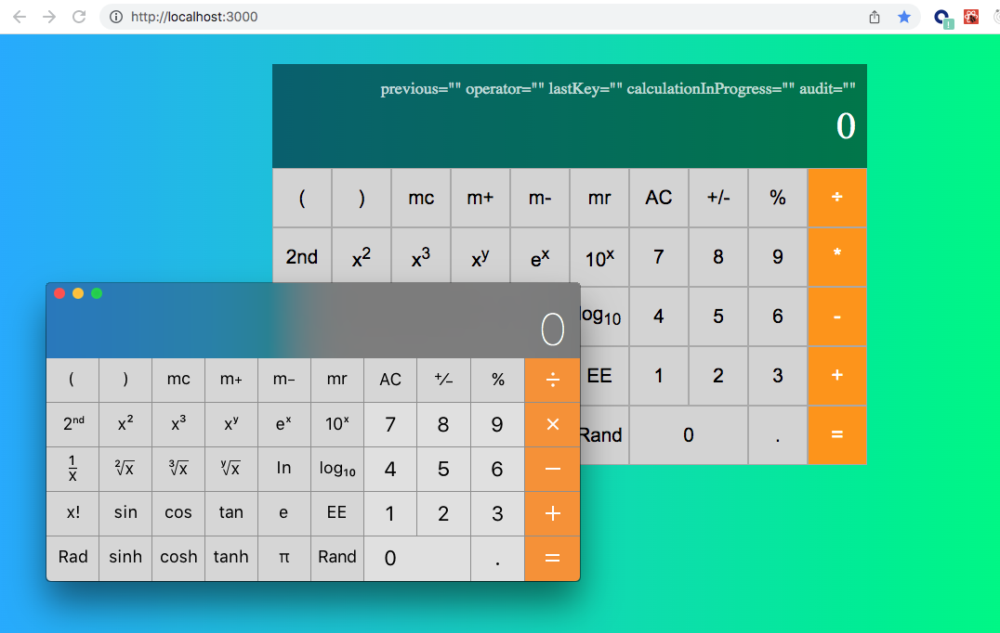

# Scientific Calculator CI/CD UI Testing Framework

the goal of this is to demo ci/cd system that runs ui and unit tests on each push of code to the remote repository - preventing any code that fails tests from entering the remote branch

- calculator is modeled to work identically to macOS/iOS calculator application.
- 340+ UI Tests written to verify every aspect of calculator expected behavior:

  - order of operations
  - trigonometric functions (hyperbolic and inverse functions)
  - exponents
  - memory capability
  - percentages
  - fixed numbers
  - keyboard shortcuts

- running tests multiple different ways: headed, headedlessly, and in one or more docker containers.
- to goal is to demonstrate spinning up multiple docker containers to run tests in parallel.
- a failure will stop code from being pushed to the remote branch.
- method of purposely failing tests built in to verify this.

## Running App

application must be running to run tests outside of a docker container

### `npm start`

## Running UI Tests With Browser

To view tests as they run sequentially

### `npm run test`

## Running UI Tests Headlessly

To view tests as they run sequentially

### `npm run test`

## Debugging Mode

### `DEBUGGING_MODE = true`

This will render a display showing the important state variables in calculator's display.

The previously saved number, the operator selected and the last key selected and whether the chosen key is part two part calculation, audit saves order of operations calculation, shortcutKeys will display last short cut key typed.

Displayed as: `previous="" operator="" lastKey="" calculationInProgress="" audit="" shortcutKeys=""`

## How To Purposely Fail Tests

Purposely Failing UI Tests In Order To Check Failing Behavior That Code Will Not be pushed to the remote repository

### `PURPOSELY_FAIL_MODE = true`

This is bypass a formatting function in the code that will cause multiple tests to fail.

This is to verify that code will not be pushed to the remote repository

### `npm run test:failing`

---

Runs the app in the development mode.\
Open [http://localhost:3000](http://localhost:3000) to view it in your browser.

The page will reload when you make changes.\
You may also see any lint errors in the console.

This project was bootstrapped with [Create React App](https://github.com/facebook/create-react-app).
